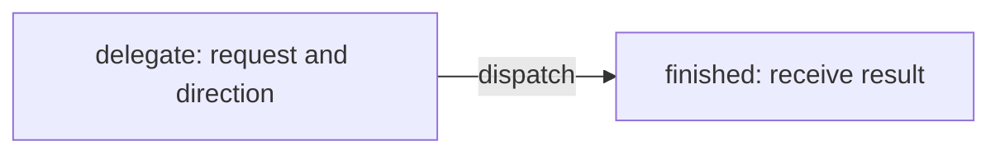
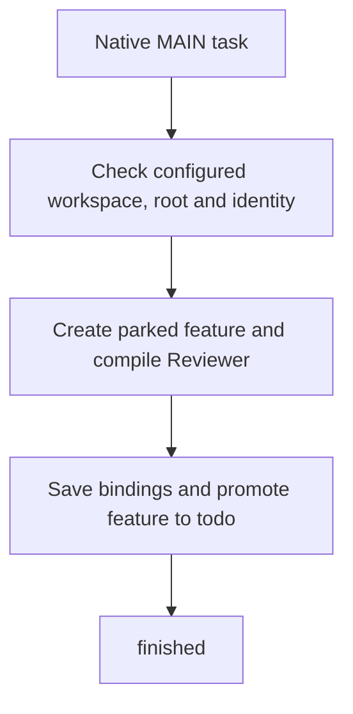

# Delegation states

```mermaid
flowchart LR
  delegate[delegate: request and direction] -->|dispatch| finished[finished: receive result]
```

State: delegate

```mermaid
flowchart TD
  entry[Native MAIN task] --> check[Check configured workspace, root and identity]
  check --> dispatch[Create parked feature and compile Reviewer]
  dispatch --> save[Save bindings and promote feature to todo]
  save --> finished[finished]
```
