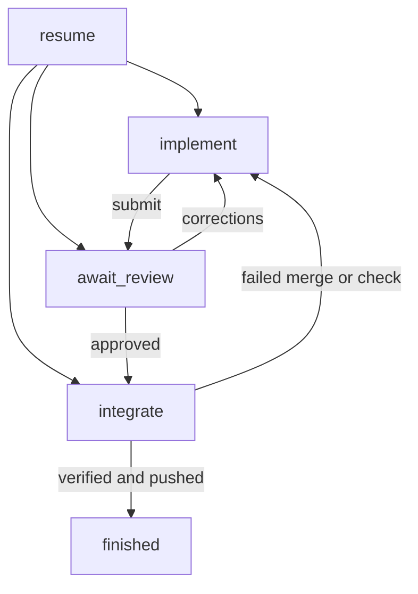
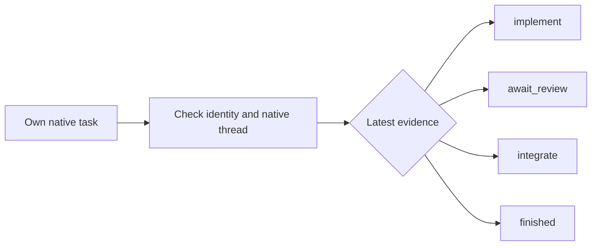
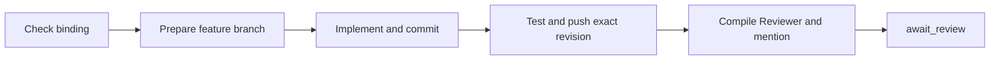
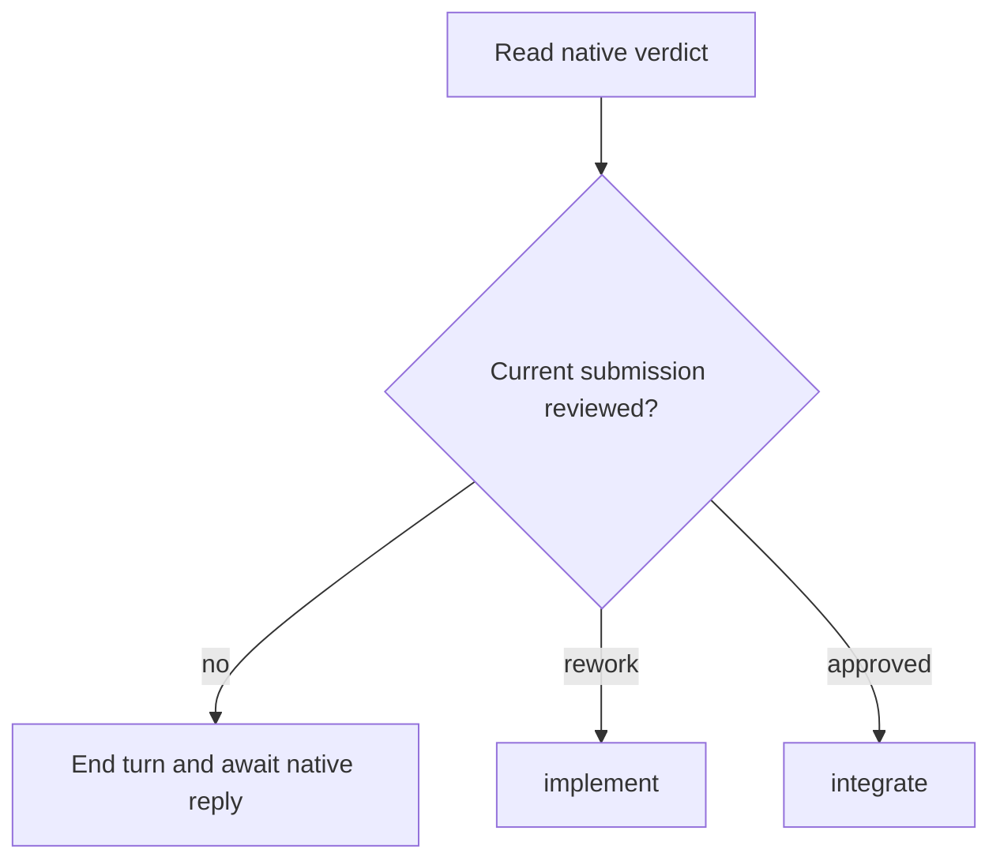
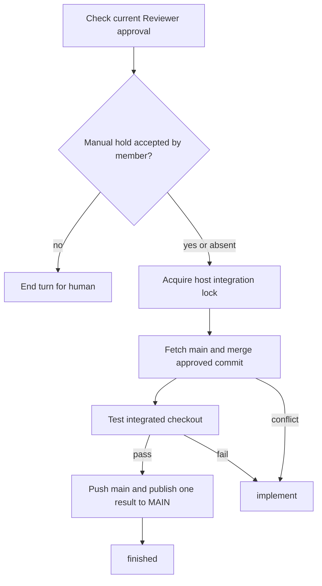

# Developer states

```mermaid
flowchart TD
  resume --> implement
  resume --> await_review
  resume --> integrate
  implement -->|submit| await_review
  await_review -->|corrections| implement
  await_review -->|approved| integrate
  integrate -->|failed merge or check| implement
  integrate -->|verified and pushed| finished
```

State: resume

```mermaid
flowchart LR
  entry[Own native task] --> check[Check identity and native thread]
  check --> route{Latest evidence}
  route --> implement
  route --> await_review
  route --> integrate
  route --> finished
```

State: implement

```mermaid
flowchart LR
  entry[Check binding] --> prepare[Prepare feature branch]
  prepare --> source[Implement and commit]
  source --> submit[Test and push exact revision]
  submit --> compile[Compile Reviewer and mention]
  compile --> await_review
```

State: await_review

```mermaid
flowchart TD
  entry[Read native verdict] --> verdict{Current submission reviewed?}
  verdict -->|no| stop[End turn and await native reply]
  verdict -->|rework| implement
  verdict -->|approved| integrate
```

State: integrate

```mermaid
flowchart TD
  entry[Check current Reviewer approval] --> hold{Manual hold accepted by member?}
  hold -->|no| wait[End turn for human]
  hold -->|yes or absent| lock[Acquire host integration lock]
  lock --> merge[Fetch main and merge approved commit]
  merge --> test[Test integrated checkout]
  test -->|pass| push[Push main and publish one result to MAIN]
  merge -->|conflict| implement
  test -->|fail| implement
  push --> finished
```
