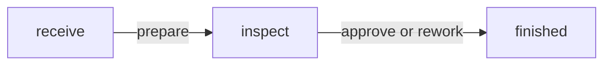
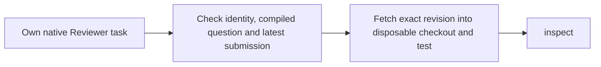
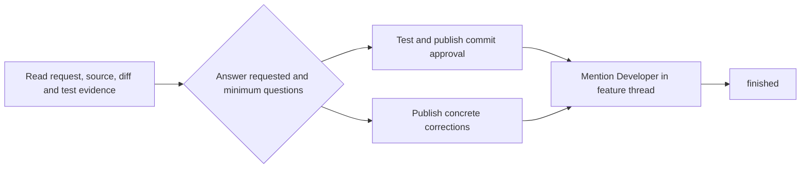

# Reviewer states

```mermaid
flowchart LR
  receive -->|prepare| inspect
  inspect -->|approve or rework| finished
```

State: receive

```mermaid
flowchart LR
  entry[Own native Reviewer task] --> check[Check identity, compiled question and latest submission]
  check --> prepare[Fetch exact revision into disposable checkout and test]
  prepare --> inspect
```

State: inspect

```mermaid
flowchart LR
  entry[Read request, source, diff and test evidence] --> judgment{Answer requested and minimum questions}
  judgment --> approve[Test and publish commit approval]
  judgment --> rework[Publish concrete corrections]
  approve --> mention[Mention Developer in feature thread]
  rework --> mention
  mention --> finished
```
